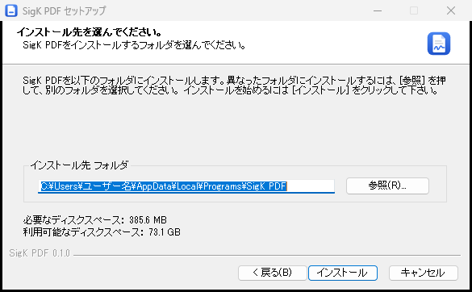
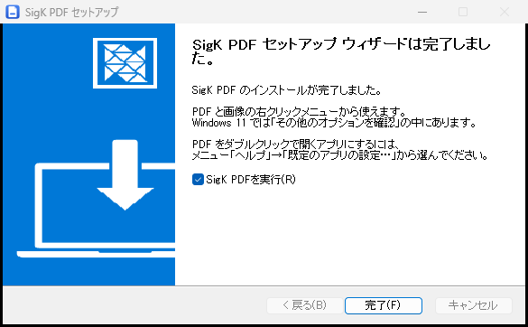
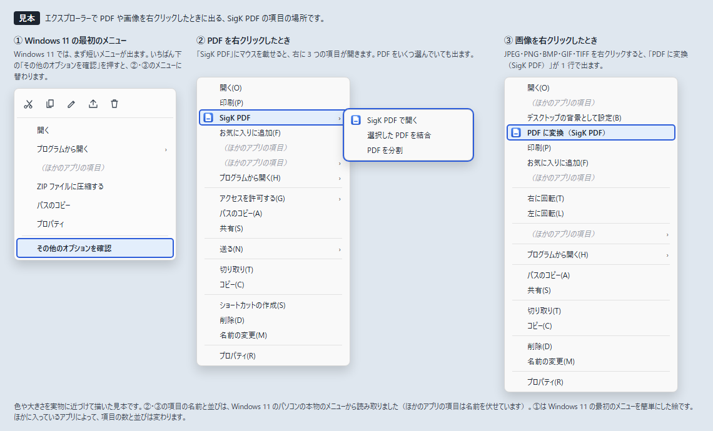
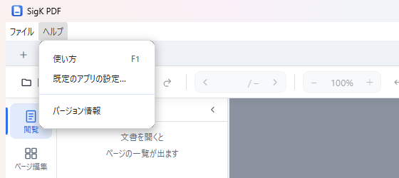
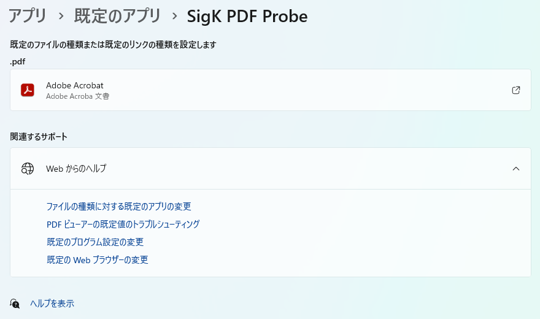

# SigK PDF インストールと使い方ガイド

SigK PDF は、PDF を読む・ページを並べ替える・結合と分割・画像との変換・ハイライトや文字の書き込みを 1 つの画面で行う
Windows のアプリです。このガイドでは、パソコンに入れて使い始めるまでと、新しい版への入れ替え・アンインストールのしかたを説明します。
各機能の操作は、アプリの中の「使い方」の窓にまとめています（9 章）。

インストーラーとメニュー「ヘルプ」の画像は、Windows 11（25H2）のパソコンで撮りました。右クリックメニューと「設定」の画面の画像は
見本で、それぞれの画像の下に出どころを書いています。Windows の画面の言葉は、Windows の版によって少し違うことがあります。

---

## 1. 動かせるパソコン

| 項目 | 条件 |
|---|---|
| Windows | Windows 10（21H2 以降）か Windows 11。64 ビット版 |
| 空き容量 | 約 390MB（インストーラーの表示は 385.6MB） |
| 管理者の権限 | 要らない（自分のユーザーにだけ入る） |
| インターネット | 要らない（入れるときも使うときも） |

Windows の版と 64 ビット版かどうかは、「設定」→「システム」→「バージョン情報」（Windows 10 では「詳細情報」）で見られます。
Windows 10 のパソコンでは、まだ動きを確かめていません。右クリックメニューの見え方は、4 章のとおり Windows 11 と違う見込みです。

---

## 2. インストールのしかた

使うのは、配られたインストーラー `SigK PDF Setup 0.1.0.exe` 1 つです。ダブルクリックして始めます。

### 2-1. Windows が青い画面で止めたとき

SigK PDF のインストーラーには、作った人を証明する電子署名を付けていません。そのため、インターネットからダウンロードした
インストーラーなどを開くと、Windows が「Windows によって PC が保護されました」という青い画面を出して止めることがあります。
受け取り方によっては、この画面は出ません。出たときは次の順に進めます。

1. 文の下にある「詳細情報」を押します。
2. 「アプリ」の欄のファイル名が `SigK PDF Setup` で始まり、「発行元」の欄が「不明な発行元」になっていることを確かめます。
   同じファイルを何回かダウンロードすると、名前の後ろに `(1)` などが付くことがあります。
3. 右下に出る［実行］を押します。

受け取った覚えのないファイルのときは、［実行しない］を押して閉じ、配った人に確かめてください。この青い画面の画像はありません。

### 2-2. インストーラーの 3 つのページ

インストーラーは、次の 3 つのページで終わります。インストールの種類（自分だけか、パソコンの全員か）を選ぶページはありません。
管理者の確認（「このアプリがデバイスに変更を加えることを許可しますか？」）も出ません。

**① インストール先のページ**

入れる場所は、ふつうは変えずに［インストール］を押します。初めから入っている場所は、自分のユーザーのフォルダーの中の
`C:\Users\（ユーザー名）\AppData\Local\Programs\SigK PDF` です。画像では、欄の中のユーザー名を「ユーザー名」に替えて撮りました。

**② 進み具合のページ**

緑の帯が右へ伸びます。前の版を入れてあったパソコンで新しい版を入れたときは、約 20 秒で次のページに移りました。

**③ 完了のページ**

「SigK PDFを実行(R)」に印が付いたまま［完了］を押すと、SigK PDF が起動します。完了のページの文のとおり、右クリックメニューは
4 章、ダブルクリックで開くアプリにする方法は 5 章で説明します。

インストーラーは、デスクトップとスタートメニューに「SigK PDF」のショートカットを作ります。次からはそこから起動します。

---

## 3. はじめて起動するとき

インストールのすぐあとの 1 回目は、2 回目より起動に時間がかかります。開発に使ったパソコンに 2026 年 10 月 8 日の版を入れて測ると、
窓が出るまで 1 回目は約 2 秒、2 回目からは 1〜1.5 秒でした。同じパソコンで、2026 年 9 月の版を作り直した直後に測ったときは、
1 回目に 5〜7 秒かかりました。1 回目が遅いのは、Windows が新しいアプリのファイルを初めて読み込み、ウイルス対策のソフトが中身を
調べるためと見ています。2 回目からは速くなるので、1 回目は待ってください。

---

## 4. 右クリックメニューの使い方

エクスプローラーで PDF や画像を右クリックすると、SigK PDF の項目が出ます。**Windows 11 では、最初に出る短いメニューには
SigK PDF の項目がありません。**いちばん下の「その他のオプションを確認」を押すと、項目の多いメニューに替わり、その中にあります。
Windows 10 では、最初のメニューに出る見込みです。

この画像は見本です。②・③は、Windows 11 のパソコンの本物のメニューの並びを読み取って描きました。①は、Windows 11 の最初の
メニューを簡単にした絵です。ほかに入っているアプリによって、項目の数と並びは変わります。

| 右クリックしたファイル | 項目 | 押したときの動き |
|---|---|---|
| PDF | 「SigK PDF」→「SigK PDF で開く」 | 選んだ PDF をタブで開く |
| PDF | 「SigK PDF」→「選択した PDF を結合」 | 画面の左の列の「ツール」の「結合」を開き、選んだ PDF を一覧に入れる。結合は［実行…］を押したときに行う |
| PDF | 「SigK PDF」→「PDF を分割」 | 「ツール」の「分割」を開き、選んだ PDF を対象にする |
| 画像（JPEG・PNG・BMP・GIF・TIFF） | 「PDF に変換（SigK PDF）」 | 「ツール」の「画像→PDF」を開き、選んだ画像を一覧に入れる |

選び方で変わることを、次にまとめます。お知らせは、SigK PDF の文書の上の端に出る細長い帯で伝えます（数秒で消えます）。

- **何個選んでも出ます。**16 個以上選ぶと、Windows の「開く」「印刷」などの項目は消えますが、SigK PDF の項目は残ります。
- **1 回の右クリックで選んだファイルは、ファイル名の順に一覧に入ります。**数字は数として比べるので、`2.pdf` は `10.pdf` より前に来ます。
  エクスプローラーで更新日時の順などに並べていても、その並びにはなりません。2 つ以上入れたときは「ファイル名の順に並べました。エクスプローラーの並びと違うときは、ドラッグで入れ替えてください。」と
  帯で知らせるので、順番を変えたいときは一覧の行をドラッグします。
- **一覧に前のファイルが残っているときは、その後ろに足されます。**ただし、［実行…］を押して終えたあとの一覧は、新しく選んだファイルに
  入れ替わります。
- **結合と画像→PDF の一覧に入るのは 100 ファイルまでです。**一覧に残っていたファイルも数に入ります。超えた分は入らず、帯で知らせます。
  入らなかったのがどのファイルかは、名前の順の後ろのものとは限りません（Windows がファイルを渡す順番が決まっていないため）。
- **「PDF を分割」は 1 つの PDF だけが対象です。**2 つ以上選んだときは、ファイル名の順で先頭の 1 つだけを対象にし、
  「1つ目のファイルだけを対象にしました。」と帯で知らせます。
- **タブは 20 個まで開けます。**20 個開いているときに「SigK PDF で開く」を押すと、新しいファイルは開かずに帯で知らせます。
- **PDF と画像を混ぜて選んだときは、右クリックしたファイルの種類の項目だけが出ます。**PDF を右クリックして「選択した PDF を結合」を押すと、
  選んだうち PDF だけが入ります。画像を右クリックして「PDF に変換」を押すと、画像だけが入ります。
- SigK PDF がもう起動しているときは、その窓に入ります。2 つ目の窓は開きません。

---

## 5. PDF をダブルクリックで開くアプリにするには

PDF をダブルクリックしたときに開くアプリ（既定のアプリ）は、Windows の決まりで、アプリの側から変えられません。使う人が自分で選びます。
SigK PDF を入れただけでは、今までのアプリ（Adobe Acrobat など）のまま変わりません。

1. SigK PDF のメニュー「ヘルプ」→「既定のアプリの設定…」を押します。

   

2. Windows の「設定」が開き、「アプリ › 既定のアプリ › SigK PDF」のページが出ます。

   

   この画像は、開発中に試しの名前「SigK PDF Probe」で入れたときに撮ったものです。実際には「SigK PDF」と出ます。

3. 「.pdf」の下の欄（いま PDF を開いているアプリの名前が出ています）を押します。出てきた窓で SigK PDF を選び、［既定値を設定］を
   押して決めます（ボタンの名前は Windows の版によって違うことがあります）。

エクスプローラーからも既定にできます。PDF を右クリックして「プログラムから開く」→「別のプログラムを選択」を押し、出てきた窓で SigK PDF を
選んで［常に使う］を押します。「プログラムから開く」の一覧に出ている SigK PDF を押すだけでは、その 1 回だけ SigK PDF で開き、
既定のアプリは変わりません。

元のアプリに戻すときも、同じ手順で元のアプリを選びます。SigK PDF を入れたあと、次に PDF を開いたときに、Windows が開くアプリを
選び直させることがある見込みです。そのときに今までのアプリを選べば、既定のアプリは変わりません。

1 の項目が開くのと同じ設定のアドレスを開くと、Windows 11（25H2）では SigK PDF のページへ直に進むことを確かめました（試しの名前で
入れたもの）。メニューそのものを押す確かめと、Windows 10 での確かめは、まだです。

---

## 6. 新しい版への入れ替え

新しい版のインストーラーを、2 章と同じ手順で入れます。前の版をアンインストールする必要はありません。最近使ったファイルの一覧や窓の
位置などの設定と、右クリックメニューは、そのまま残ります。5 章で SigK PDF を既定のアプリに選んでいた場合も、その選択は残る見込みです。

**入れ替える前に、SigK PDF を閉じてください。**保存していない変更があれば、先に保存します。開いたままインストーラーを動かすと、
「SigK PDF が起動しています。OKをクリックして、閉じてください。閉じない場合は、手動で閉じてください。」という窓が出ます。
［OK］を押すと SigK PDF が閉じられ、保存していない変更は消えます。

---

## 7. アンインストールのしかた

**始める前に、SigK PDF を閉じてください**（6 章と同じ窓が出て、保存していない変更が消えるため）。

1. Windows の「設定」→「アプリ」→「インストールされているアプリ」を開きます。
2. 一覧の「SigK PDF 0.1.0」の右の「…」を押し、「アンインストール」を押します。確かめの小さな窓が出たら、もう一度「アンインストール」を
   押します。
3. SigK PDF のアンインストールの窓が出たら、ボタンを押して進め、最後に［完了］を押します。

Windows 10 では、「設定」→「アプリ」→「アプリと機能」を開き、一覧の「SigK PDF 0.1.0」を押すと出る［アンインストール］を押します。

アンインストールで消えるのは、SigK PDF の本体、デスクトップとスタートメニューのショートカット、右クリックメニューの項目、
「プログラムから開く」の一覧の SigK PDF です。SigK PDF で保存した PDF は消えません。

**設定は残ります。**最近使ったファイルの一覧・窓の位置・書き込みの色や作成者名・エラーの記録（ログ。8 章）は、`%APPDATA%\SigK PDF` の
フォルダーに残り、入れ直すとそのまま使えます。すっかり消したいときは、エクスプローラーのアドレス欄に `%APPDATA%` と打って Enter を押し、
出てきた中の「SigK PDF」のフォルダーを削除します。

SigK PDF を既定のアプリにしていた場合は、アンインストールのあと、PDF の既定のアプリが無い状態になる見込みです。次に PDF を開くと、
Windows がどのアプリで開くかを聞いてくるので、使うアプリを選んでください。SigK PDF の側から、前に使っていたアプリへ戻すことはできません。

---

## 8. 困ったとき

| 困ったこと | 見るところ・すること |
|---|---|
| 右クリックしても SigK PDF の項目が無い | Windows 11 では「その他のオプションを確認」の中にある（4 章） |
| 起動が遅い | インストールのすぐあとの 1 回目は、2 回目より時間がかかる（3 章） |
| 結合や変換の一覧に、選んだファイルが全部入らない | 一覧に入るのは、残っていた分も含めて 100 ファイルまで。混ぜて選んだときは、右クリックしたファイルの種類だけが入る（4 章） |
| 右クリックで送ったファイルが、すぐに一覧に入らない | SigK PDF で確かめの窓や保存の窓が開いている間は、入るのを待つ。窓を閉じると入る |
| 開いた PDF を保存できない | パスワードで保護された PDF は、読めるが保存できない。左の列の「ツール」を開いている間も保存できないので、「閲覧」などに切り替える |
| PDF のダブルクリックで SigK PDF が開かない | 既定のアプリを選んでいない（5 章） |
| SigK PDF の版を知りたい | メニュー「ヘルプ」→「バージョン情報」 |

うまく動かないときは、エラーの記録（ログ）が `%APPDATA%\SigK PDF\logs` のフォルダーの `error.log` に残ります。エクスプローラーの
アドレス欄に `%APPDATA%\SigK PDF\logs` と打って Enter を押すと開けます。配った人に相談するときは、このファイルを渡すと原因を
調べやすくなります。ログには開いたファイルの場所と名前が入るので、渡す前に中身を確かめてください。

---

## 9. 各機能の使い方

結合・分割・変換・書き込みなど、各機能の操作は、アプリの中の「使い方」の窓に書いてあります。次のどれかで開きます。

- ツールバーの右端の「？」を押す
- F1 キーを押す
- メニュー「ヘルプ」→「使い方」を押す

開いた窓の左の目次から、知りたい機能を選びます。窓は、そのとき使っているモード（画面の左の列の「閲覧」「ページ編集」「編集」
「ツール」のどれか）の説明を出して開きます。
